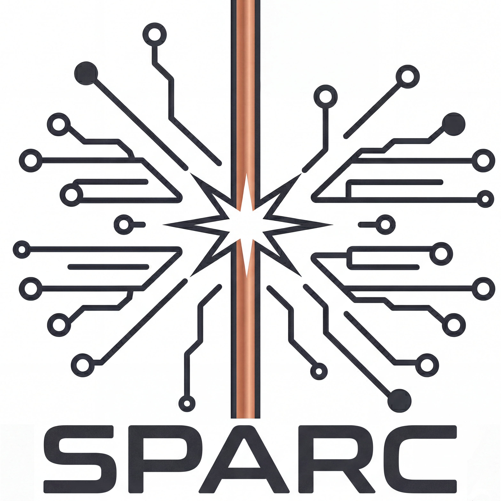

<p align="center">
  
</p>

# SPARC - Wire EDM Learning Environment

[](https://www.python.org/downloads/)
[](https://opensource.org/licenses/MIT)

SPARC (Simulation Platform for Advanced Rough-Cut Control) is a Python package that implements a simplified stochastic simulation of a 1D Wire Electrical Discharge Machining (Wire EDM) process, designed for reinforcement learning research.

This environment is compatible with the [Gymnasium](https://gymnasium.farama.org/) library (formerly OpenAI Gym), facilitating the efficient testing of reinforcement learning algorithms and various control strategies specific to the Wire EDM process.

## Features

- **Gymnasium-compatible environment** for Wire EDM simulation
- **Modular architecture** with separate physics modules (ignition, wire heating, material removal, etc.)
- **Configurable parameters** for different wire materials and cutting conditions
- **Real-time visualization** support
- **Comprehensive logging** capabilities for analysis

## Installation

### From Source
```bash
# Clone the repository
git clone https://github.com/geduardo/SPARC.git
cd SPARC

# Install in development mode
pip install -e .

# Or install with visualization support
pip install -e ".[visualization]"
```

## Quick Start

```python
import numpy as np
from wedm import WireEDMEnv, EnvironmentConfig

# Create environment with default configuration
env = WireEDMEnv()

# Or customize the configuration
config = EnvironmentConfig(
    workpiece_height=15.0,  # mm
    wire_diameter=0.25,     # mm
    wire_material="brass",
    target_cutting_distance=800.0,  # µm
)
env = WireEDMEnv(config=config)

# Reset environment
obs, info = env.reset()

# Run simulation with random actions
for _ in range(1000):
    # Sample random action
    action = env.action_space.sample()
    
    # Step environment
    obs, reward, terminated, truncated, info = env.step(action)
    
    if terminated:
        break

print(f"Simulation completed. Wire broken: {info.get('wire_broken', False)}")
```

## Performance Profiling

Use the profiling harness to benchmark the local `src` tree against a stable
active-cutting workload before and after optimization changes.

```bash
python scripts/profile_simulation.py --segment-len 0.2 --segment-len 0.05 --steps 100000 --initial-gap 12 --warmup 2000 --repeats 3 --hotspots both
```

The script reports:

- median and per-repeat throughput in steps per second
- module-level wall-time shares for quick hotspot scans
- `cProfile` hotspots for deeper function-level analysis
- crater counts per run derived from fresh crater-forming discharges, even when
  analysis-history tracking is disabled
- machine and power context so you can tell whether a run happened on battery,
  under a capped processor policy, or with no direct thermal visibility
- per-scenario fidelity signatures for regression checks

The conservative realtime benchmark contract for this PC is documented in
[`docs/performance_realtime_baseline.md`](docs/performance_realtime_baseline.md).

For the frozen conservative baseline preset, use:

```bash
python scripts/profile_realtime_baseline.py
```

To compare a candidate profile against a baseline report directly:

```bash
python scripts/profile_simulation.py --compare-to outputs/profiling/realtime_baseline_20260322_i1.json --json-out outputs/profiling/candidate.json
```

To run the frozen preset as a timestamped candidate verification, archive the
result, and refresh the dashboard in one command:

```bash
python scripts/verify_realtime_candidate.py
```

You can also write a machine-readable snapshot for later comparison:

```bash
python scripts/profile_simulation.py --json-out outputs/profiling/baseline.json
```

To turn collected profiling JSON files into a standalone progress dashboard:

```bash
python scripts/build_perf_dashboard.py
```

That writes `outputs/profiling/performance_dashboard.html`, which tracks
throughput history, distance to the 1 s wall / 1 s simulated target, archived
before/after comparisons versus the baseline, and the latest module drilldown
from module-level down to matching `cProfile` hotspots.

## Advanced Usage

### Custom Control Strategy

```python
import numpy as np
from wedm import WireEDMEnv

# Create environment
env = WireEDMEnv(mechanics_control_mode="position")
obs, info = env.reset()

# Define a simple control strategy
def simple_controller(state):
    """Simple proportional controller."""
    gap = state.workpiece_position - state.wire_position
    target_gap = 25.0  # µm
    
    # Proportional control
    error = target_gap - gap
    servo_command = np.clip(0.1 * error, -1.0, 1.0)
    
    return {
        "servo": np.array([servo_command]),
        "generator_control": {
            "target_voltage": np.array([80.0]),
            "current_mode": np.array([5]),  # I5
            "ON_time": np.array([3.0]),
            "OFF_time": np.array([80.0]),
        }
    }

# Run simulation with custom controller
done = False
while not done:
    action = simple_controller(env.state)
    obs, reward, terminated, truncated, info = env.step(action)
    done = terminated or truncated
```

### Logging and Analysis

```python
from wedm import WireEDMEnv
from wedm.utils.logger import SimulationLogger

# Configure logger
logger_config = {
    "signals_to_log": ["wire_position", "workpiece_position", "voltage", "current"],
    "log_frequency": {"type": "every_step"},
    "backend": {"type": "json", "filepath": "simulation_data.json"}
}

# Create environment and logger
env = WireEDMEnv()
logger = SimulationLogger(logger_config, env)

# Run simulation
obs, info = env.reset()
for _ in range(10000):
    action = env.action_space.sample()
    obs, reward, terminated, truncated, info = env.step(action)
    logger.collect(env.state, info)  # Collect data each step

    if terminated:
        break

# Finalize and save logged data
logger.finalize()
```

## Visualization Dashboard

SPARC includes a web-based visualization dashboard for analyzing simulation results.

### Generate Data and Launch Dashboard

```bash
# 1. Run simulation to generate NPZ data
python examples/quickstart.py

# 2. Convert to JSON for dashboard
python scripts/npz_to_json.py quickstart_*.npz -o visualization/data/simulation_data.json

# 3. Open the dashboard
cd visualization
python -m http.server 8000
# Then open http://localhost:8000/dashboard.html
```

### Dashboard Features

- **Side View**: Wire, workpiece, and spark visualization
- **Virtual Oscilloscope**: Real-time voltage/current traces
- **Top View**: Debris concentration heatmap
- **Thermal Profile**: Wire temperature distribution
- **Timeline Controls**: Play, pause, and scrub through simulation

See [visualization/README.md](visualization/README.md) for detailed documentation.

## Documentation

For detailed documentation, please visit our [documentation page](https://github.com/geduardo/SPARC/wiki).

## Examples

Check out the `examples/` directory for a quickstart example demonstrating basic environment usage.

## Contributing

We welcome contributions! Please see our [Contributing Guidelines](CONTRIBUTING.md) for details.

## Citation

If you use this environment in your research, please cite:

```bibtex
@software{wedm_learning_environment,
  author = {Gonzalez Sanchez, Eduardo},
  title = {Wire EDM Learning Environment},
  year = {2025},
  url = {https://github.com/geduardo/SPARC}
}
```

## License

This project is licensed under the MIT License - see the [LICENSE](./LICENSE.md) file for details.

## Acknowledgments

This work was developed as part of research on applying reinforcement learning during the PhD Thesis of Eduardo Gonzalez Sanchez at ETH Zurich.
